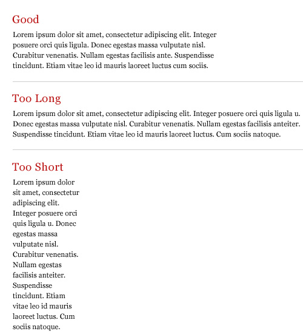
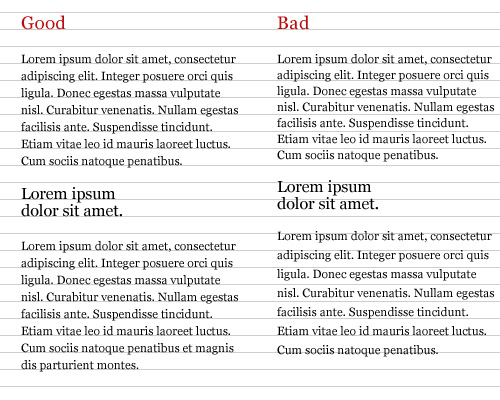
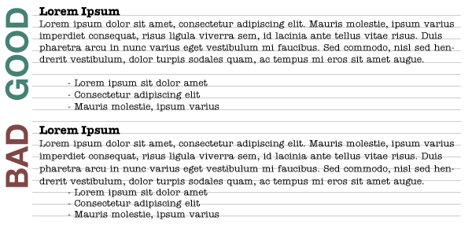
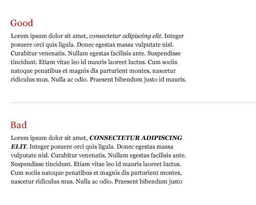
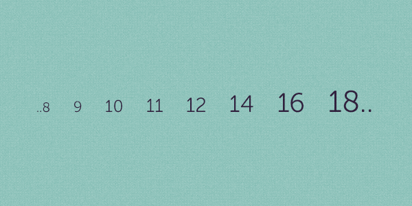

# Week 6: Enhancing Framework UI/UX

## Web Typography

Visual communication is the most important aspect of any design including web, and typography plays a critical role in that communication. However, the web presents the additional challenge of communicating across platforms. This makes font size, weight, color, leading (line-height), kerning (letter spacing), and balance all the more important components to consider when crafting a website. However, no differently than print, the difference between good typography and bad typography is work that looks professional versus work that looks amateur.

**Table of Contents**

<!-- START doctoc generated TOC please keep comment here to allow auto update -->
<!-- DON'T EDIT THIS SECTION, INSTEAD RE-RUN doctoc TO UPDATE -->
<!-- END doctoc generated TOC please keep comment here to allow auto update -->

- [Optimal line length](#optimal-line-length)

<!-- END doctoc generated TOC please keep comment here to allow auto update -->

### Line length
Similar to print, the otimal line length is **45-75 characters per line**. This increases overally readability and legibility of your text. However, because a line length of 65 characters may look different on an iPhone than on 27-inch monitor, your line-length should be fluid and adapt with your typographic scale and screen width.



_Credit: [Smashing Magazine](http://www.smashingmagazine.com/2009/04/8-simple-ways-to-improve-typography-in-your-designs/)_

**Pro Tip**
- A handy technique is to create a dummy paragraph element with lorem ipsum text, and drop in a `<span style="color: red;">*</span>` at the **45th** and **75th** characters. See below:

```html
<p>Lorem ipsum dolor sit amet, consectetur adip<span style="color: red;">*</span>isicing elit, sed do eiusmod <span style="color: red;">*</span>tempor incididunt ut labore et dolore magna aliqua.</p>
```

**References:**
- [CodePen Example: Line Length](http://codepen.io/micjamking/pen/7dde55eb8b327b51eb60302322c3e8a2)
- [Trent Walton: Fluid Type](http://trentwalton.com/2012/06/19/fluid-type/)

### Leading (line height)
Leading, or `line-height` in CSS, is simply the vertical space between rows of text in a paragraph. A proper line height helps increase legibility and establish a visual rhythm to the page.

Below are some basic, helpful principles to follow:
- The larger the text, the less leading is needed
- The longer the length, the more leading is needed
- The shorter the length, the less leading is needed


_Credit: [Smashing Magazine](http://www.smashingmagazine.com/2009/04/03/8-simple-ways-to-improve-typography-in-your-designs/)_


_Credit: [Design Instruct](http://designinstruct.com/tools-basics/the-basics-of-typography/)_

_Can you spot which is correct? Number 2 is the closest to have the optimal reading experience, but leading could be increased a bit more._

The simplest rule to follow is to set your `line-height` value **to 1.5 and adjust +-0.3 based on your the specific typeface and your `font-size`**. `line-height` is generally applied to the `body` element in CSS since that is where you typically establish your base font settings for your designs.

```css
body {
  ...
  line-height: 1.5;
}
```
_You'll notice that for `line-height` you can use a unitless value, ie. it doesn't need to be `px`, `%`, or `em/rem`. This means the number is just a simple multiplier (ie. one and a half times)_

Line height and width are always going to be relative to the typeface you are using, so use what you have learned and do your best to select the proper measurements.

References:
- [CodePen: Line Height](http://codepen.io/micjamking/pen/c7f6cd1fb7923199add507a14b4e5ee4)

### Vertical Rhythm
Just as important and your vertical grid for layout, a baseline grid is essential for your type layout. This allows your readers to easily follow the flow of text by creating a continuous rhythm. This is very important to keep text on a consistent grid and I feel this is often the most difficult to achieve.


_Credit: [Smashing Magazine](http://www.smashingmagazine.com/2009/04/03/8-simple-ways-to-improve-typography-in-your-designs/)_


_Credit: [Code Tuts](http://code.tutsplus.com/tutorials/6-ways-to-improve-your-web-typography--net-6248 )_

To be consistent with vertical rhythm, vertical spacing (margins) between elements and your `line-height` should be the same. ie. Set your body's `line-height`, paragraph's, and heading's bottom margin to be the same final value.

```css
// 16px = 1rem = 100% = default font size
body {
  line-height: 1.5;
}

h1,
h2,
h3,
h4,
h5,
h6,
p {
  margin-bottom: 1.5rem;
}
```
_**Question:** How can we improve this with Sass?_

Need help? Try these tools:
- [http://www.gridlover.net/app/ 
- https://drewish.com/tools/vertical-rhythm/

### Text Emphasis
Giving emphasis to a word or phrase without interrupting the reader is also important to think about. Italicized and bolded text, different colors, weights, sizes, and typefaces are all different ways to emphasize text. However, much like in print, you should exercise restraint and use as few as possible to effectively communicate your message.



_Remember, when setting italics, use `em` for emphasis (not `i` tags) and `strong` for bold text (not `b` tags)._

### Typographic Scales
You may have heard about the [golden ratio](https://en.wikipedia.org/wiki/Golden_ratio) and how using it in your designs can help create more harmonious proportions. This is due to using a mathematical scale or multiplier which establishes a rhythm. In web design, a modular scale helps establish a consistent rhythm to govern the size of our type and other elements.



Creating scales is fairly simple; you pick a base size (ie. 16px or 1em) and a scale multiplier (ie. 1.618). Multiply the result once to get your first size, then multiply that result by your multiplier to get your second size, and so on.

```
1em // Base font size
1em * 1.618     = 1.618em // h6
1.618em * 1.618 = 2.618em // h5
2.618em * 1.618 = 4.236em // h4
...
```
Setting up these calculations can be repititious and tedious, so this is where working with Sass can help, through it's variables, functions, and mixins.

**In-Class Example**

**References:**
- [A List Apart: More Meaningful Typography](http://alistapart.com/article/more-meaningful-typography)
- [Typecast: A More Modern Scale for Web Typography](http://typecast.com/blog/a-more-modern-scale-for-web-typography)
- [Web Design Tuts: How to Establish a Modular Typographic Scale](http://webdesign.tutsplus.com/articles/how-to-establish-a-modular-typographic-scale--webdesign-14927)
- [Type Scale](http://type-scale.com/)